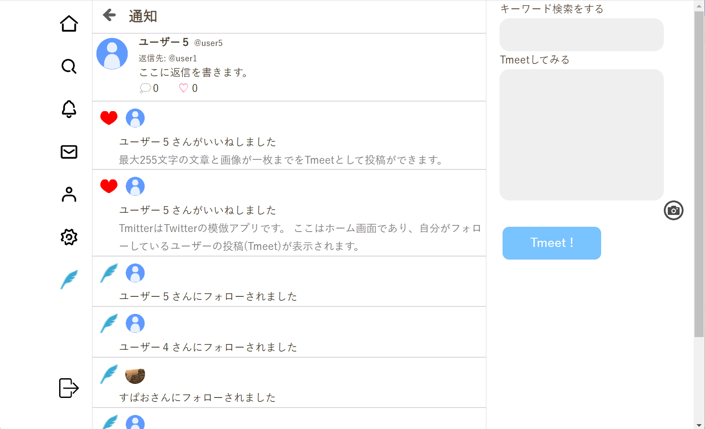
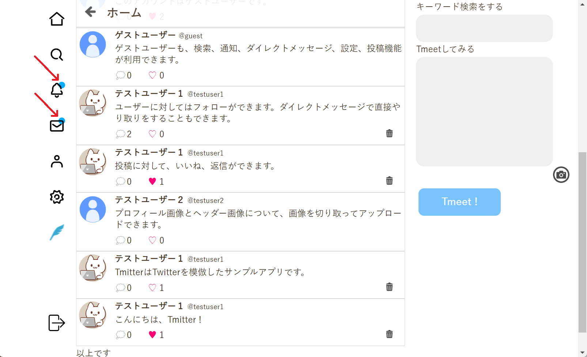

# ポートフォリオ紹介
短文投稿SNS Tmitter (http://18.177.215.25) 
以下の情報でゲストログインが可能です。 
username: guest 
password: pasuwa-do  

以下の内容で解説しております。
* Tmitterの概要
* 実装機能
* 使用技術

# Tmitterの概要
## テーマ
T*m*itterは既存のSNSアプリ「T*w*itter」を模したアプリです。短文の投稿機能を中心に、通知、ダイレクトメッセージ等の基本的な機能を全般的に実装しています。 
詳しくは下記の実装機能をご覧ください。

## こだわり
ユーザーの利用の快適さを重視しました。具体的には、いいね、フォロー、投稿の読み込み、ダイレクトメッセージや通知を受け取る際にページ全体を更新することなく結果が反映されるように実装しました。これによりユーザーにアクションをする度の更新の待ち時間がないようにしました。

# 実装機能
※⑤以外の画像はTmitter機能を実際に使っているYouTube動画へのリンクです。クリックしてご確認ください。
## ①短文投稿
◆短文の投稿、画像も添付可能 
 
◆いいね機能 
 
◆返信機能 
 
◆削除機能 
 
## ②ユーザー機能
◆新規登録 
 
◆ログイン 

 
◆ログアウト 
 
◆フォロー機能 
 
## ③検索
◆投稿とユーザーの部分一致検索 
 
## ④ダイレクトメッセージ
◆他のユーザーとショートメッセージのやり取りが可能 
 
◆画面の更新不要でリアルタイムでメッセージが更新されます 
 
## ⑤通知
◆自分が受け取ったフォロー、いいね、ダイレクトメッセージの一覧 
 
◆新規の通知やダイレクトメッセージがあった際にリアルタイムで知らされます 
 

# 使用技術
◆フロントエンド 
* HTML/CSS 
* Javascript 

◆バックエンド 
* Python 
* Django（Pythonフレームワーク） 

◆インフラ 
* AWS EC2（仮想サーバー） 
* Gunicorn（Webアプリ起動） 
* Nginx（Webサーバー） 
* PostgreSQL（データベース） 
* Github（バージョン管理） 
